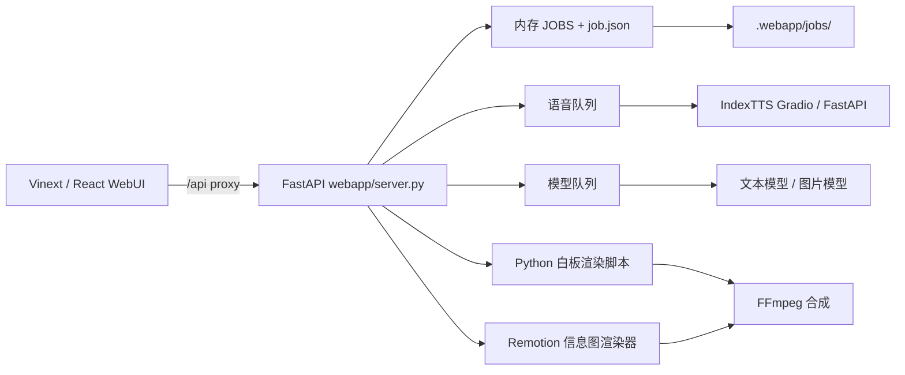

# 当前架构评审

## 1. 系统组成

当前系统是一个本地模块化雏形，但应用编排仍集中在单文件中。



主要代码职责：

| 位置 | 当前职责 |
| --- | --- |
| `web/app/page.tsx` | 创建表单、模式切换、配置、任务轮询、进度、历史、图库、提示词修改、素材预览和成片播放 |
| `webapp/server.py` | API、配置、任务状态、队列、恢复、Provider 调用、分镜、图片生成、渲染和合成编排 |
| `scripts/` | 白板渲染、字幕、图片文字、场景合并和时间线算法 |
| `video_renderer/` | Whisper 对齐与 Remotion 动态信息图渲染 |
| `.webapp/jobs/` | 任务元数据、输入素材、中间产物和最终视频 |
| 根目录 `SKILL.md` | 一条基于 SRT、人工确认和手工标注的旧式 Skill 工作流 |

## 2. 当前生产流程

### 2.1 标准制作与自定义参考

```text
提交任务
→ 整篇文案克隆为 voice.wav
→ 根据文案生成 plan.json
→ 按字符长度分配各场景 duration_ms
→ 将 1–4 个场景组合成 board
→ 生成 board 图片
→ 自动生成等宽矩形 annotation
→ 渲染 board MP4
→ 合并无声视频
→ 与 voice.wav、字幕合成为 final.mp4
```

标准制作与自定义参考共享同一流程；后者只是在图片生成时增加风格图与人物参考。

### 2.2 动态信息图

```text
提交任务
→ 整篇文案克隆为 voice.wav
→ Whisper token 对齐
→ phrase-timeline.json
→ 内容结构与页面计划
→ deck-spec.json / content-timeline.json
→ 按插图槽位生成图片
→ Remotion 渲染
→ 与 voice.wav 合成为 final-remotion-v1.mp4
```

这条 legacy 路径已有“真实音频时间 → 内容结构 → PPT 规格 → 插图”契约。迁移时应保留读取和复现能力，同时把新信息图任务接入统一 `mountain-av-v1` 阶段图与时间契约。

## 3. 应保留的基础

当前实现已经具备若干值得保留的能力：

- 本地项目目录保存配置、输入、检查点和最终结果；
- 文件先写 `.partial`，校验后再替换正式产物；
- Provider 请求包含重试和错误信息转换；
- 任务支持取消、失败重试、服务重启恢复和重新渲染；
- 语音、模型和本地渲染具有不同资源调度策略；
- 白板渲染、音视频合成、时间线算法已经部分脚本化；
- 动态信息图具有独立且严格的语义时间契约。

Mountain 应通过抽取和契约化复用这些能力，而不是从头重写。

## 4. 核心问题

### 4.1 业务编排与入口耦合

`webapp/server.py` 同时承担 HTTP 协议、任务仓储、队列、领域规则、第三方 Provider、进程管理和工作流编排。任何新的入口都只能：

- 调用 HTTP；
- 导入带全局状态的 Server 私有函数；
- 或复制已有逻辑。

三种方式都不能形成可靠共享内核。

### 4.2 标准白板的音画边界是估算值

当前标准流程先合成完整语音，再按场景文本长度分配时长。它能让总视频时长接近配音，却不能证明每个画面与实际说话边界一致。长文案中还会在字幕层再次按字符比例估算。

新流程必须在 TTS 前按语义、内容密度和服务能力产生 Voice Unit，并同时确定每个 Unit 内一个或多个 Visual Item 的连续原文范围。每个 Unit 独立配音后优先通过 Whisper 映射图片切换点；对齐无效时，整个 Unit 按实际 Voice 时长和图片数量等分，并显式记录 fallback。

### 4.3 状态与产物没有清晰分离

当前 `job.json` 同时保存用户参数、队列信息、阶段、计时、检查点和结果引用。恢复逻辑大量依赖文件是否存在，没有统一记录：

- 产物属于哪个 pipeline version；
- 它由哪些输入生成；
- 输入是否已经改变；
- 文件存在但内容是否仍有效；
- 哪些下游产物需要失效。

### 4.4 UI 概念模型错误

当前 `pageMode = standard | custom | infographic` 把两个维度混在一起：

- `whiteboard | infographic-remotion` 是输出引擎；
- `preset | custom-reference` 是视觉来源。

这种建模使页面条件分支、后端字段和历史任务标签都不断增加特殊判断。

### 4.5 单页承担全部功能

当前页面同时管理：

- 服务配置；
- 新建任务；
- 三种模式的全部表单；
- 当前及共享任务进度；
- 历史记录；
- 任务详情；
- 图片图库和提示词重生成；
- 输入素材预览；
- 成片播放和下载。

多个独立定时轮询同时更新相互重叠的任务状态，页面状态难以推理，也不利于后续加入 Voice Unit、Visual Item 和 Trace 级进度。

### 4.6 现有 Skill 与 Web 流程不等价

根目录 Skill 以 SRT 为输入，要求每一步人工确认，并使用预览台手工修改 annotation。WebUI 则以文案和参考音频为输入，自动执行任务队列。二者的输入、阶段、产物目录和控制策略都不同。

该 Skill 可作为人工精修路径保留，但不能被视为 Mountain 七个 Skills 的实现基础。

### 4.7 日志无法形成跨入口运行链

当前启动器只把后端和前端 stdout/stderr 分别写入 `.webapp/backend-output.log`、`backend-error.log`、`frontend-output.log` 和 `frontend-error.log`；`job.json` 中保存阶段 `timings`。这些信息能帮助本机启动排障，但还不是可跟踪的工作流日志：

- 没有持久 `run_id/trace_id/command_id/span_id` 关联 Web、Skill、Provider 和子进程；
- 没有区分可恢复 Domain Event、Diagnostic Log 和 Audit Record；
- 没有 Unit/Visual、Provider retry、Whisper fallback 和媒体质量的统一事件；
- stdout/stderr 无统一结构、轮转、保留、大小限制与脱敏保证；
- WebUI 和 Skills 无法查询同一条 Trace 或导出同一份诊断包。

因此现有日志应在迁移期作为 legacy 进程日志保留，但不能成为新 Run 的状态事实。目标约束见 [12-observability-and-diagnostics.md](12-observability-and-diagnostics.md)。

## 5. 迁移约束

1. 不能破坏现有 `.webapp/jobs/<id>` 历史任务的观看、下载和重新渲染。
2. 新旧 pipeline 必须通过显式版本区分，不根据文件猜测后静默混用。
3. 首批重构应以特征测试保护当前行为，再移动代码。
4. Provider 调用和渲染结果成本高，任何迁移都必须优先保证不重复调用。
5. 动态信息图旧契约通过 legacy adapter 保留；所有新任务统一业务阶段和时间 Artifact，视觉规划与 renderer 仍可不同。
6. WebUI 仍需保留一键自动生产，阶段化不应迫使普通用户逐步点击。

## 6. 现有设计资料的关系

- `docs/pr-semantic-audio-visual-segmentation.md` 是早期标准白板精确同步需求来源，Mountain 将其收口为 Voice Unit / Visual Item 和单元级 fallback。
- `docs/semantic-timing-contract.md` 是现有动态信息图的 legacy 时间契约。
- Mountain 为所有新任务提供统一共享内核、时间 Artifact、双入口、UI、Skills 和可观测性；旧文档只用于迁移和回归参考。
