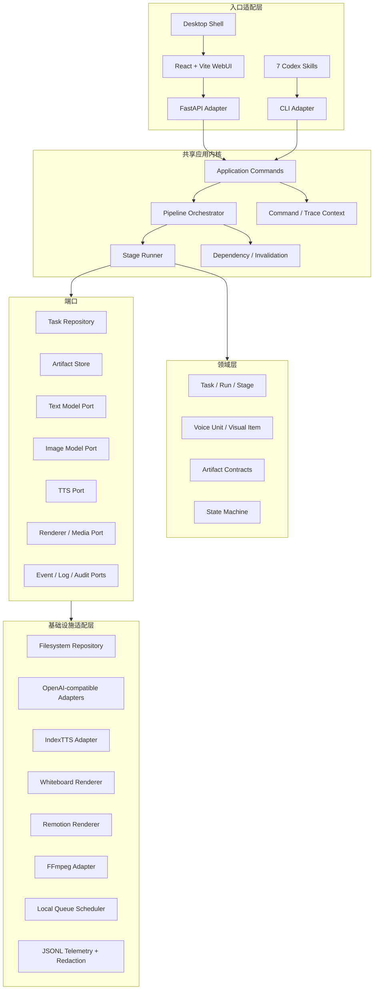
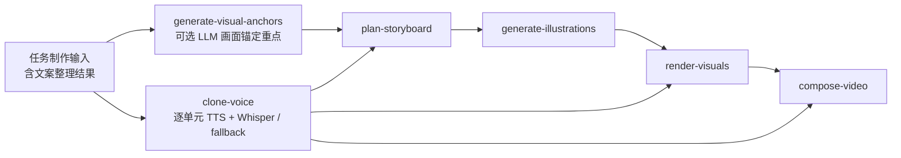

# 目标架构：WebUI 与 Skills 共享内核

## 1. 架构结论

Mountain 采用“模块化单体 + Ports and Adapters”。现阶段不拆微服务；模型、语音、媒体和渲染可以继续使用远程服务或本地进程，但业务规则必须从 FastAPI、React 和 Skill 中抽离。



核心不变量：

> FastAPI route、React 页面、桌面壳和 Skill 都不能实现分割、提示词、配音、时间同步、渲染或恢复规则；它们只能把输入转换为共享应用命令，并消费共享查询、事件和诊断结果。

## 2. 推荐代码布局

```text
csboard/
├── domain/
│   ├── models.py             # Task、Run、Stage、VoiceUnit、VisualItem、ArtifactRef
│   ├── enums.py              # engine、stage/status、timing_source
│   ├── errors.py             # 稳定错误码与领域异常
│   └── validation.py         # 跨产物不变量
├── application/
│   ├── commands.py           # create/run/retry/cancel/invalidate/query
│   ├── context.py            # entrypoint、command_id、trace_id、actor
│   ├── orchestrator.py       # pipeline graph 与阶段调度
│   ├── stage_runner.py       # 幂等、状态转换、产物提交、跨度
│   ├── observability.py      # 领域事件、日志、审计和指标门面
│   └── pipelines.py          # mountain-av-v1 与 legacy 定义
├── stages/
│   ├── generate_visual_anchors.py
│   ├── clone_voice.py
│   ├── plan_storyboard.py
│   ├── generate_illustrations.py
│   ├── render_visuals.py
│   └── compose_video.py
├── ports/
│   ├── repositories.py
│   ├── providers.py
│   ├── renderers.py
│   ├── media.py
│   └── telemetry.py
└── adapters/
    ├── filesystem/
    ├── openai_compatible/
    ├── indextts/
    ├── renderers/
    ├── scheduler/
    └── observability/        # JSONL、redaction、diagnostic bundle、可选 OTLP

webapp/
├── api/                      # request/response schema 与 routes
├── dependencies.py           # 组合根，装配 csboard adapters
└── server.py                 # FastAPI app、生命周期、Vite dist 托管

cli/
└── csboard.py                # python -m cli.csboard ... --json/--events jsonl

skills/
└── <skill-name>/SKILL.md     # 薄交互层，只调用 CLI

web-v2/                       # 新 React + Vite SPA；与 legacy web/ 物理隔离
```

`csboard` 是中立包，不依赖 `webapp`、`cli`、Electron/Tauri 或 Skills。入口可以依赖 `csboard`，反向依赖禁止。现有 `web/` 仅作为 legacy 前端保留；新页面只能在 `web-v2/` 创建，不能通过跨目录导入复用旧页面状态。

## 3. 共享内核的详细职责

### 3.1 Domain

领域层只保存稳定概念和规则，不执行网络或进程调用：

- Task、Run、Stage 的身份、版本和状态机；Task 是当前制作聚合根，Project 保留给未来多 Task 的上层组织；
- Voice Unit 的连续原文范围、顺序、独立 Voice 和 TTS 状态；
- Visual Item 的父单元、连续原文范围、图片和实际时间区间；
- `timing_source=whisper|equal_fallback` 的完整单元级约束；
- Artifact 的逻辑 key、hash、依赖和 schema version；
- 文字覆盖率、时间连续性、引用一致性和稳定错误码。

领域对象不包含 FastAPI `Request`、React 字段、Codex 消息、Provider SDK 类型或日志输出格式。

### 3.2 Application Commands

所有入口共同使用以下命令：

```python
create_task(request, command_context) -> TaskView
run_pipeline(task_id, execution_policy, command_context) -> RunView
run_stage(task_id, stage_name, options, command_context) -> StageResult
retry_stage(task_id, stage_name, command_context) -> StageResult
invalidate_from(task_id, artifact_key, reason, command_context) -> InvalidationResult
cancel_run(task_id, run_id, command_context) -> RunView
get_task(task_id) -> TaskView
get_run_trace(task_id, run_id) -> TraceView
list_tasks(query) -> list[TaskSummary]
```

`CommandContext` 至少包含 `entrypoint`、`command_id`、actor 和调用时间。新 Run 生成唯一 `trace_id`；同一 Run 从 WebUI、Skill 或 CLI 恢复时保持该 `trace_id`，但每次动作使用新的 `command_id`。命令返回结构化 View，并公开这些关联 ID，不返回框架对象。

### 3.3 Pipeline Orchestrator

编排器负责：

1. 根据 `pipeline_id` 和 `engine` 读取 pipeline graph；
2. 解析目标阶段及其依赖；
3. 检查阶段输入 fingerprint，复用有效产物并标记失效产物；
4. 调用 Stage Runner；
5. 为 Run 和 Stage 建立父子 span；
6. 记录结构化领域事件、诊断日志、指标与审计记录；
7. 按 execution policy 决定自动继续或等待确认。

编排器不包含图片提示词、FFmpeg 参数、HTTP route 或 Skill 文案。

### 3.4 Stage Runner

所有阶段通过统一协议运行：

```python
class Stage(Protocol):
    name: str
    contract_version: int

    def fingerprint(self, context: StageContext) -> str: ...
    def validate_inputs(self, context: StageContext) -> None: ...
    def execute(self, context: StageContext) -> StageResult: ...
    def validate_outputs(self, result: StageResult) -> None: ...
```

固定顺序：

```text
锁定任务
→ 开始 Stage span 并写 running 事件
→ 校验输入和 fingerprint
→ 可复用则返回 cached
→ 执行到临时路径
→ 校验输出
→ 原子移动候选 Artifact，但暂不注册
→ 追加 succeeded/failed Domain Event
→ 更新 Artifact 索引与状态投影、写指标和诊断摘要
→ 结束 span 并解锁任务
```

阶段失败不得把 `.partial` 文件注册为正式 Artifact。异常必须保留稳定 `error_code`、`retryable`、关联 ID 和经过脱敏的原因链。

### 3.5 Ports

阶段只能依赖端口接口：

| Port | 能力 |
| --- | --- |
| `TaskRepository` | 读取/写入 Task、Run、Stage 状态并做并发控制 |
| `ArtifactStore` | 解析逻辑 key、临时写入、原子提交、哈希、校验和失效 |
| `TextModelPort` | Provider-neutral 文案和分镜生成，由 OpenAI-compatible adapter 翻译协议 |
| `ImageModelPort` | Provider-neutral 文生图/参考图请求，能力不支持时显式返回 unsupported |
| `TTSPort` | 参考音色合成，不关心 Gradio/FastAPI 细节 |
| `AlignmentPort` | Whisper 对齐、置信度和失败原因；不决定 fallback 策略 |
| `RendererPort` | 白板或 Remotion 渲染 |
| `MediaPort` | probe、规范化、拼接、字幕和音画合成 |
| `DomainEventSink` | 可恢复的状态事实与可游标订阅事件 |
| `DiagnosticLogSink` | Provider、媒体、进程和性能诊断日志 |
| `AuditSink` | 谁从何入口执行了哪个命令及其结果 |
| `Redactor` | Secret、正文、提示词和外部响应的统一脱敏策略 |

三类观测数据共享 `task_id/run_id/trace_id/command_id/span_id`，但职责和存储分离。完整规范见 [12-observability-and-diagnostics.md](12-observability-and-diagnostics.md)。

## 4. 两种工作方式如何保持一致

### 4.1 WebUI 路径

```text
React form
→ POST /api/tasks
→ create_task()
→ POST /api/tasks/{id}/runs
→ run_pipeline()
→ 事件游标 API + 任务查询 API + 诊断 API
→ React task workbench
```

### 4.2 Skills 路径

```text
用户自然语言
→ workflow skill 归一化参数
→ python -m cli.csboard task create --request request.json --json
→ python -m cli.csboard pipeline run --task <id> --json --events jsonl
→ 同一个 create_task() / run_pipeline()
→ 使用 trace_id 查询状态、解释 fallback 或导出诊断包
```

CLI 必须能够直接调用共享内核，不能依赖本机 FastAPI 才能工作。stdout 用于机器可读 JSON/JSONL，stderr 用于人类进度，退出码稳定。

### 4.3 桌面 APP 路径

```text
Electron/Tauri 薄壳
→ 启动并监管 FastAPI sidecar
→ FastAPI 同源托管 React + Vite dist 与 /api
→ 健康检查通过后加载本机 URL
→ 同一个 create_task() / run_pipeline()
→ 平台数据目录、工具链、系统密钥和日志 adapter
```

桌面壳选择不能进入 Domain 或 Stage。完整约束见 [10-desktop-app-architecture.md](10-desktop-app-architecture.md)。

### 4.4 禁止的实现方式

- Skill 内保存另一份风格 prompt 或自行实现恢复逻辑；
- Skill 或 Web route 直接调用模型、IndexTTS、Whisper、FFmpeg 或渲染脚本；
- Web route 直接修改 `job.json`；
- WebUI 和 Skills 各自维护一份进度真相或日志格式；
- 以 UI 显示文案作为状态机阶段 key；
- 通过复制目录绕过 Artifact Store 注册；
- 根据某个文件“碰巧存在”判断阶段必然完成；
- 日志记录 API key、完整正文、完整 prompt、参考音频内容或 Provider 原始响应。

## 5. 统一 Pipeline Graph



默认 UI 和 Skills 都展示这六个生产阶段；第七个 Skill 是跨阶段 orchestrator。

文案整理在 Task 创建时确定 Voice Unit，不属于 Run 中的 LLM 生产阶段。`generate-visual-anchors` 可选地产生可追溯的重点文字与原文范围；`clone-voice` 对每个 Unit 独立生成 Voice，并用 Whisper 获取文字边界。`plan-storyboard` 决定每个 Unit 的 Visual Item 数量和对应锚点。成功时按边界设置图片切换点，失败或结果不合法时，整个 Voice Unit 根据实际音频总时长按 Visual Item 数量等分。一个 Unit 不能混用精确时间和估算时间。

白板和动态信息图使用同一个阶段图和 Artifact 契约，区别由 `engine=whiteboard|infographic-remotion` 选择视觉规划与 renderer adapter。现有动态信息图专有流程作为 legacy adapter 保留，不能继续演化为第二套新内核。

分单元的首要收益是避免超长 TTS 单请求、支持单元级重试和减少失败返工；它不保证降低总计算量。是否并行 TTS 由资源策略和音色一致性验证决定。

## 6. 运行状态与事件

### 6.1 Task 与 Stage

```text
Task: draft → ready → running → succeeded
                           ├→ failed
                           └→ cancelled

Stage: pending → running → succeeded
          │         ├→ failed
          │         └→ cancelled
          └→ skipped
       succeeded → stale → running
```

`cached` 是本次调用结果，不是持久状态。输入改变后，Task 回到 `ready`，受影响 Stage 进入 `stale`。

### 6.2 结构化进度事件

```json
{
  "schema_version": 1,
  "record_id": "event-01J6...",
  "sequence": 42,
  "timestamp": "2026-08-29T10:30:00.000+08:00",
  "event_name": "voice_unit.progress",
  "entrypoint": "web",
  "task_id": "task-123",
  "run_id": "run-456",
  "trace_id": "trace-456",
  "command_id": "command-789",
  "span_id": "span-voice-003",
  "stage": "clone-voice",
  "unit_id": "unit-003",
  "completed": 2,
  "total": 8,
  "message": "正在生成第 3/8 个配音单元"
}
```

WebUI 渲染同一事件流，Skills/CLI 可按游标消费并总结。`message` 只负责显示；状态投影和恢复只使用结构化字段。日志不能代替领域事件驱动恢复。

## 7. 并发与资源治理

- 同一 Task 同时只允许一个改变产物的 Run；读取、日志查看和下载不受影响。
- TTS 按 Voice Unit 调度；任务内默认串行，验证音色一致性后可配置最多 2 个并行单元。
- 图片可在全局模型并发限制内按 Visual Item 并行，结果必须按 `visual_id` 原子登记。
- 本地渲染并发由共享资源策略控制，不由 WebUI 或 Skill 自行设置。
- 取消 token 传播到 Provider 等待、子进程以及 unit/visual 循环。
- 每次 Provider、Whisper、TTS 和子进程调用建立子 span，记录延迟、重试、退出码和产物指标；不得记录 Secret 或完整内容。
- 锁、队列位置和 worker 身份属于运行状态，不写入业务产物 manifest。

## 8. 版本与兼容

| Pipeline | 状态与用途 |
| --- | --- |
| `mountain-av-v1` | 所有新标准、自定义参考、白板和动态信息图任务；由 `engine` 选择 renderer |
| `standard-v1-legacy` | 只读历史任务或显式复现现有整篇配音流程 |
| `whiteboard-semantic-v2` | 设计期标识，迁移为 `mountain-av-v1`，不再作为新任务默认值 |
| `infographic-remotion-v8` | 现有动态信息图兼容 adapter，不再新增独立核心能力 |

每个 Artifact 同时记录自身 schema version、pipeline id、engine 和生成 fingerprint。读取旧任务时通过显式 adapter 转成只读 View；除非用户发起迁移，否则不改写旧目录。新任务不能根据文案长度自动选择 legacy pipeline。

## 9. 错误模型

```json
{
  "code": "TTS_NODE_UNAVAILABLE",
  "stage": "clone-voice",
  "retryable": true,
  "task_id": "task-123",
  "run_id": "run-456",
  "trace_id": "trace-456",
  "span_id": "span-voice-003",
  "unit_id": "unit-003",
  "message": "无法连接语音节点",
  "details": {"node_index": 1}
}
```

WebUI 根据 `code` 决定按钮；Skills 根据 `retryable` 决定是否建议或执行重试；诊断页通过关联 ID 定位上下游 span。不得从中文消息猜测错误类型。
