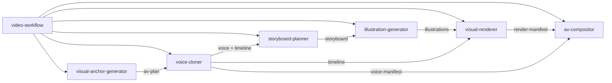

# 七个 Skills 设计

## 1. 定位

Skills 是共享内核的自然语言入口，负责收集参数、调用稳定 CLI、解释结构化结果、请求必要确认，以及选择完整执行、单阶段执行、恢复或返工。

Skills 不实现 Provider、Prompt Builder、文案整理算法、Whisper fallback、文件恢复或媒体渲染。WebUI 与 Skills 必须看到同一 Task、Run、Artifact、事件、日志和 Trace。

M04 的 Skills 先驱动标准制作；`custom-reference` 和 `infographic-remotion` 的参数归一化与能力 Skill 扩展在 M09 接入，在此之前必须由 Capability API 明确拒绝。

## 2. 目录建议

```text
skills/
├── video-workflow/
│   └── SKILL.md
├── visual-anchor-generator/
│   └── SKILL.md
├── voice-cloner/
│   └── SKILL.md
├── storyboard-planner/
│   └── SKILL.md
├── illustration-generator/
│   └── SKILL.md
├── visual-renderer/
│   └── SKILL.md
└── av-compositor/
    └── SKILL.md
```

若后续以 Codex Plugin 分发，再由 manifest 打包；共享 Python 内核不能复制进各 Skill。

## 3. CLI 与可观测性边界

Skills 只调用：

```bash
python -m cli.csboard <resource> <action> [options] --json
```

长时间运行可以增加 `--events jsonl`。规范如下：

- stdout：最终 JSON，或显式选择的稳定 JSONL 事件流；
- stderr：人类可读进度，不作为成功判断依据；
- 退出码：稳定映射成功、校验失败、依赖缺失、可重试失败和取消；
- 每个启动/恢复结果返回 `task_id/run_id/trace_id/command_id`；
- Skill 保存关联 ID，用于后续查询、重试、跨入口恢复和诊断；
- Skill 只能通过结构化事件、View 和 Error 判断状态，不能解析日志字符串。

成功示例：

```json
{
  "ok": true,
  "command": "stage.run",
  "task_id": "task-123",
  "run_id": "run-456",
  "trace_id": "trace-456",
  "command_id": "command-789",
  "stage": "generate-visual-anchors",
  "result": "succeeded",
  "cached": false,
  "artifacts": ["planning.av-plan"],
  "warnings": [],
  "next_stage": "clone-voice"
}
```

失败示例：

```json
{
  "ok": false,
  "task_id": "task-123",
  "run_id": "run-456",
  "trace_id": "trace-456",
  "command_id": "command-790",
  "error": {
    "code": "SEGMENTATION_COVERAGE_INVALID",
    "stage": "generate-visual-anchors",
    "retryable": false,
    "message": "文案分割未完整覆盖原文"
  }
}
```

诊断命令：

```bash
python -m cli.csboard run trace --task <id> --run <run-id> --json
python -m cli.csboard events list --task <id> --run <run-id> --after <cursor> --json
python -m cli.csboard logs tail --task <id> --run <run-id> --follow --json
python -m cli.csboard diagnostics export --task <id> --run <run-id> --json
```

## 4. Skill 1：`video-workflow`

### 职责

- 创建或选择 Task；
- 收集文案、参考音频、引擎、视觉来源和成片设置；
- 校验 capability 并选择 execution policy；
- 编排六个生产阶段；
- 用事件 cursor 汇报进度，在中断后用同一 `trace_id` 恢复；
- 汇总最终产物、fallback 和质量告警；
- 必要时导出脱敏诊断包。

### 非职责

- 不自行拆分文案、生成 prompt 或执行 Provider/脚本；
- 不将对话记录、终端输出或日志当成 Task 状态；
- 不维护不同于 WebUI 的进度或重试规则。

### 执行策略

| 策略 | 行为 |
| --- | --- |
| `auto` | 验证后自动运行到 final，与 WebUI 默认行为一致 |
| `gated` | 每阶段成功后展示摘要并等待确认 |
| `targeted` | 只运行指定阶段及必要依赖 |

策略只控制是否继续，不改变领域结果或 fingerprint。

```bash
python -m cli.csboard task create --request request.json --json
python -m cli.csboard pipeline run --task <id> --policy auto --json --events jsonl
python -m cli.csboard pipeline resume --task <id> --json --events jsonl
python -m cli.csboard task show --task <id> --json
```

## 5. Skill 2：`visual-anchor-generator`

### 输入与输出

- 输入：保存的 Task 文案整理结果、可选画面锚定开关、风格约束；
- 输出：`planning.visual-anchors`、重点/原文范围摘要和规划告警。

### 强制规则

- 不重新分段、合并、改写或删除已保存 Voice Unit；
- 每个重点必须引用所属 Unit 的连续原文范围；
- 不生成 Voice、图片构图或毫秒时间；
- 关闭开关时明确 skipped，不调用 LLM；
- 锚点范围越界、重叠或不属于所属 Unit 时失败；
- 锚点变化只使分镜及下游视觉产物失效，不重做 Voice 或对齐。

```bash
python -m cli.csboard stage run --task <id> --stage generate-visual-anchors --json
```

## 6. Skill 3：`voice-cloner`

### 输入与输出

- 输入：Task 文案整理结果、参考音频、TTS profile 和 Whisper profile；
- 输出：每个 Voice Unit 的规范化 WAV、`audio.voice-manifest`、`timing.timeline`、兼容母带和质量告警。

### 强制规则

- 每个 Voice Unit 独立生成一条 Voice；默认顺序合成，验证音色一致性后才允许小并发；
- 有效单元音频不得重复调用 TTS，失败单元可单独重试；
- TTS 输入严格等于 Unit 原文，临时写入、probe 后原子提交；
- 每条 Voice 尝试 Whisper 对齐，并验证覆盖率、单调性和边界；
- 对齐无效时整个 Unit 使用实际 Voice 时长按 Visual Item 数量等分；
- 必须登记 `timing_source=whisper|equal_fallback` 和稳定 reason code；
- fallback 产生 warning 和事件，但不使任务失败。

```bash
python -m cli.csboard stage run --task <id> --stage clone-voice --json
python -m cli.csboard stage retry --task <id> --stage clone-voice --unit unit-003 --json
```

## 7. Skill 4：`storyboard-planner`

### 输入与输出

- 输入：AV Plan、Timeline、style preset 或参考素材元数据、重点文字设置；
- 输出：`planning.storyboard`、全局视觉 bible 和每个 Visual Item 的视觉规划。

### 强制规则

- 不改变 Unit/Visual 的原文、数量、顺序、范围或时间；
- 每个 Visual Item 对应一张主图，图片数量由 AV Plan 决定；
- 视觉一致性在全局 bible 中定义，不依赖上一张随机结果；
- 图片 prompt、overlay 和构图由共享 Prompt Builder 生成；
- WebUI 或 Skill 修改规划都必须通过共享 command 产生新 revision。

```bash
python -m cli.csboard stage run --task <id> --stage plan-storyboard --json
python -m cli.csboard artifact show --task <id> --key planning.storyboard --json
```

## 8. Skill 5：`illustration-generator`

### 输入与输出

- 输入：Storyboard、风格/人物参考 Artifact、图片模型 profile；
- 输出：每个 Visual Item 的 source image、本地后处理 image 和 `illustrations.manifest`。

### 强制规则

- 图片模型不得生成中文、Logo 或水印；
- source 与本地后处理结果分开保存；
- 单图重生成只使该 `visual_id` 的 clip 和 final 失效；
- 素材必须通过 Artifact Store 读取；
- 不根据 `web|skill` 入口改变 prompt 或 Provider profile。

```bash
python -m cli.csboard stage run --task <id> --stage generate-illustrations --json
python -m cli.csboard stage retry --task <id> --stage generate-illustrations --visual visual-003-01 --json
```

## 9. Skill 6：`visual-renderer`

### 输入与输出

- 输入：Illustration Manifest、Timeline、renderer 设置和可选 annotation revision；
- 输出：每个 Visual Item 的 clip、silent master 和 `render.manifest`。

### 强制规则

- `engine=whiteboard` 使用白板 renderer，`engine=infographic-remotion` 使用 Remotion adapter；
- 每个 clip 的目标时长只取 Timeline，不重复运行 Whisper 或计算 fallback；
- 校验开场无提前露图、最终帧完整、尺寸/fps 和时长容差；
- annotation 修改只重绘受影响 Visual；
- 不执行最终音画合成。

```bash
python -m cli.csboard stage run --task <id> --stage render-visuals --json
python -m cli.csboard stage retry --task <id> --stage render-visuals --visual visual-003-01 --json
```

## 10. Skill 7：`av-compositor`

### 输入与输出

- 输入：Voice Manifest、Timeline、Render Manifest、字幕与编码策略；
- 输出：可选 SRT、`output.final-video`、`output.final-manifest` 和 A/V 质量报告。

### 强制规则

- 字幕 cue 不跨 Voice Unit 边界；
- Voice 和 Visual 按稳定顺序恰好使用一次；
- 每个 Unit 的 Visual 完整覆盖对应 Voice 时长；
- 失败不得覆盖最后一个有效 final revision；
- `validation.passed != true` 时不能报告完成。

```bash
python -m cli.csboard stage run --task <id> --stage compose-video --json
```

## 11. Skill 间协作



能力 Skill 可单独触发。缺少上游时 CLI 返回 `MISSING_DEPENDENCY` 和所需 Stage；是否补齐由 workflow skill 或用户命令决定。所有节点继承同一 `run_id/trace_id`，每次 Skill 命令产生独立 `command_id`，Provider/进程调用建立子 span。

## 12. 日志与用户沟通规则

- 正常进度来自 Domain Event；诊断细节来自 Diagnostic Log；用户动作来自 Audit Record；
- Skill 汇报 fallback 时说明受影响 Unit 和最终采用“平均切图”，但继续执行；
- 错误回复至少包含 `error_code`、Stage、可重试性和短 `trace_id`；
- 只有排障需要时才读取 debug 日志，默认先读取 Trace 摘要；
- 导出的诊断包必须由共享 Redactor 处理，Skill 不自行拼装日志压缩包；
- 不把 API key、完整 prompt、完整正文、参考音频内容或 Provider 原始响应回显到对话。

## 13. 与旧根 Skill 的关系

现有根 `SKILL.md` 后续迁移为明确命名的 `manual-srt-whiteboard`：继续支持 SRT + 人工标注精修，使用新 Artifact Store，并复用 renderer/compositor；它不宣称与自动 pipeline 等价。

## 14. Skills 验收

- 七个 Skill 中只有 workflow skill 包含跨阶段编排；
- Skill 文件不含服务 URL/API Key、IndexTTS 参数、FFmpeg 命令、Whisper 算法或完整 prompt；
- 每个能力 Skill 可对已有 Task 独立运行；
- CLI JSON 包含稳定 code、Stage、retryable 和四个关联 ID；
- Web 创建的 Run 可由 Skill 使用同一 `trace_id` 继续，反向亦然；
- `auto/gated/targeted` 不改变已执行阶段 fingerprint；
- fallback、Provider retry、进程错误可在 WebUI 与 CLI 查到同一结构化记录；
- 日志与诊断包通过 Secret canary、正文和路径脱敏测试。
