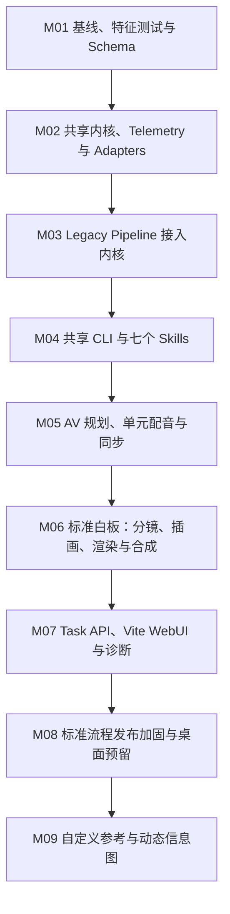

# Mountain PR 实施路线（9 个 PR）

## 1. 压缩原则

将原先 13 个小 PR 压缩为 9 个。前 8 个只跑通和稳定“标准制作 + 预设风格白板”闭环；自定义参考与动态信息图放入最后一个扩展 PR。合并的是必须共同验收、接口稳定后不会单独带来用户价值的相邻能力；不合并契约基线、共享内核、旧流程切换这三个风险隔离点。

每个 PR 必须可独立评审和回滚，包含契约或行为保护测试。新旧 pipeline 在迁移期显式并存，禁止通过文件存在性或文案长度暗中分流。

## 2. 总览

| PR | 合并原范围 | 用户可见变化 | 风险 |
| --- | --- | --- | --- |
| M01 | 文档基线、特征测试、Schema | 无 | 低 |
| M02 | Domain、仓储、Artifact、Telemetry、Provider/Media/Process adapter | 无 | 中 |
| M03 | Legacy Pipeline 抽取 | 理论无变化 | 高 |
| M04 | 共享 CLI、七个 Skills | Agent 可驱动现有与新核心能力 | 中 |
| M05 | AV Plan、Unit TTS、Whisper/fallback、母带、恢复 | 长文案可分单元同步 | 高 |
| M06 | 标准白板的 Storyboard、插画、Renderer、合成 | 首个可交付新流程成片 | 高 |
| M07 | Task API、React/Vite WebUI、Trace/诊断工作台 | 新任务工作台与可跟踪分析 | 中 |
| M08 | 标准流程兼容、桌面预留、发布与安全加固 | 标准流程默认候选 | 中 |
| M09 | 自定义参考、动态信息图扩展 | 最后接入两类视觉分支 | 高 |

## 3. M01：基线、特征测试与 Schema

### 交付

- 固化 Mountain 文档和决策；
- `task/run/script-preparation/visual-anchors/voice/timeline/storyboard/illustration/render/final` Schema；
- Domain Event、Diagnostic Log、Audit Record Schema；
- 当前创建、队列、prompt、图片重生成、重渲染、下载和 gallery 的特征测试；
- legacy 脱敏 fixture、Secret canary 和 JSON/关联 ID fixture。

### 验收与回滚

- 默认测试不依赖真实模型或 TTS；
- Schema fixture 和当前 Python/Web 测试通过；
- legacy fixture 可生成稳定快照；
- 仅新增测试和文档，可直接回滚。

## 4. M02：共享内核、Telemetry 与 Adapters

### 交付

- 中立 `csboard` 包：Task、Run、Stage、VoiceUnit、VisualItem、ArtifactRef、Error 和状态机；
- filesystem Repository、Artifact Store、fingerprint、revision、stale 与任务锁；
- `CommandContext`、`trace_id/command_id/span_id`；
- JSONL Event/Log/Audit、Redactor、metrics 和诊断包 port/adapters；
- OpenAI-compatible Text/Image profile、TTS、Whisper Alignment、Media、Process、Toolchain、Secret Store ports/adapters；
- fake adapter 与 capability/retry/error 映射。

### 验收

- `.partial` 不注册，原子提交、并发、失效、恢复和 legacy 只读 View 正确；
- Event 可重建投影，Log 不参与业务恢复；
- Provider/进程 span、取消、重试和有界 stderr 可查询；
- Secret canary 不出现在 Event、Log、Audit、错误或 CLI/API view；
- 未接入生产 Web route，必要时可整体撤回。

## 5. M03：Legacy Pipeline 接入共享内核

### 交付

- Application Commands、Orchestrator、Stage Runner 和 scheduler adapter；
- 旧 voice/model/render/compose 迁为 stage class；
- FastAPI route 只做 request/response 转换；
- legacy Run 接入关联 ID、Stage 事件、诊断日志和 Audit。

### 验收与回滚

- 同一 fixture 的 prompt、文件、阶段结果和 API View 与当前流程等价；
- 重启、取消、失败重试和重渲染通过；
- route 不直接操作 `JOBS`、Provider 或 subprocess；
- 保留一个发布周期的 legacy orchestration adapter，可通过装配配置回退。

## 6. M04：共享 CLI 与七个 Skills

### 交付

- `task/pipeline/stage/artifact/events/run/logs/diagnostics/service` CLI；
- JSON/JSONL stdout、stderr 人类进度和稳定退出码；
- `video-workflow` 与六个能力 Skill；
- `auto/gated/targeted` 策略、跨入口恢复和诊断说明；
- 旧根 Skill 的迁移说明。

### 验收

- CLI 直接调用 Application Commands，不依赖 FastAPI；
- Web 创建的 Run 可由 Skill 查询/恢复，反向亦然；
- 所有入口复用同一 `trace_id`，每次动作有新 `command_id`；
- Skill 不含 Provider、Whisper、渲染、fallback 或日志实现；
- 中断恢复不重复昂贵调用，诊断包使用统一 Redactor。

## 7. M05：AV 规划、单元配音与同步

### 交付

- 文案整理：新建任务时确定 Voice Unit 连续文字范围；`generate-visual-anchors` 仅在开关开启时生成重点与原文范围；
- `clone-voice`：Unit 级 TTS、probe、规范化、Whisper 对齐、等分 fallback、母带与恢复；
- `av-plan.json`、`voice-manifest.json`、`timeline.json`；
- Unit 调度、公平性、取消和 Unit/Provider/Whisper spans。

### 验收

- 文案 100% 覆盖，Unit/Visual 范围无重叠且稳定；
- 已成功 Unit 不重复 TTS，失败 Unit 可独立重试；
- Whisper 成功时边界合法；失败时整 Unit 严格等分并产生 warning；
- 每个 Unit 仅有一个 `timing_source`；
- IndexTTS 的语气、单请求长度和可选两路并发通过目标环境 smoke test。

## 8. M06：标准白板分镜、插画、渲染与合成

### 交付

- `plan-storyboard`、Prompt Builder、visual bible；
- `generate-illustrations`、source/final image、单图 revision；
- `render-visuals` 首版只接白板 renderer；
- `compose-video`、字幕、质量验证和 final manifest；
- Storyboard/Illustration/Render/Final Artifact、媒体指标与精确失效。

### 验收

- 分镜不改变 Unit/Visual 的文字、数量、范围或时间；
- 单图或单 Visual 重做只影响必要下游；
- 白板 Visual 只消费 Timeline，无遗漏/重复；
- 字幕不跨 Voice Unit，A/V 时长通过容差；
- `validation.passed=false` 不能成功，所有媒体调用可由 Trace 定位。

## 9. M07：Task API、Vite WebUI 与诊断工作台

### 交付

- 纯 React + Vite SPA；生产由 FastAPI 同源托管 `dist`；
- Task/Run/Stage/Unit/Visual/Artifact/Capability API；
- `/tasks/new`、任务队列、任务工作台、设置、诊断页；
- 在任何新增 Task API 前完成 `Project → Task` 的 Domain/API/CLI/WebUI/Skills/Schema 一次性迁移；
- 文案整理作为 Task 创建期确定性输入，画面锚定重点作为可选 LLM 阶段；
- Event cursor、Trace、日志筛选、指标、fallback 标签和诊断包；
- legacy View、集中 query 和单 Unit/Visual 重试入口。

### 验收

- 一次点击自动完成仍为默认；
- Web 与 CLI/Skills 对同一 Run 显示相同状态、warning、事件和 Trace；
- 刷新、服务重启和 cursor 过期后可恢复；
- 不存在重复轮询或前端自建状态机；
- 生产构建不需要 Vinext/RSC/Cloudflare Worker；
- 日志/诊断包脱敏、基本可访问性和响应式测试通过。

## 10. M08：标准流程、桌面与发布加固

### 交付

- Task 术语、目录、API 与 CLI 的发布清理，不保留 Project 兼容 alias；
- RuntimePaths、桌面 toolchain/sidecar/日志目录、Electron spike 准备；
- 日志轮转、保留、诊断包、性能/安全审计和发布说明；
- Windows/macOS smoke test 和升级/恢复策略。

### 验收

- 标准白板新任务使用 `mountain-av-v1`，并达到默认发布门槛；
- Web、Skill、CLI、Desktop 的同一 Run 可使用同一 Trace 分析；
- 离线桌面可导出脱敏诊断包；
- Task 的查看、下载、重试、恢复和新建 Run 全链路通过；

## 11. M09：自定义参考与动态信息图扩展

### 交付

- `visual_source=custom-reference`：风格图、人物组、稳定引用和 capability 校验；
- `engine=infographic-remotion`：将动态信息图映射到同一 `mountain-av-v1` Artifact、Timeline、Trace 与六个 Stage；
- 为两类分支增加独立的 Storyboard/Prompt/renderer adapter，实现不进入共享 Domain 或入口层；
- 旧 `infographic-remotion-v8` 只读兼容和显式迁移；
- 扩展 WebUI/Skills 的 capability、预览、错误、诊断与回归测试。

### 验收

- 自定义参考和动态信息图均复用标准流程的 Voice Unit、Whisper/fallback、Artifact、Event、Log、Audit 和 Trace；
- 不支持的模型/引擎组合由 Capability API 显式返回，不靠页面隐藏；
- 白板标准流程的结果、性能和默认入口不因扩展分支回归；
- 动态信息图所有 Visual 只消费统一 Timeline，旧任务仍可查看/下载；
- 三类流程均通过同一发布、安全和诊断包验收。

## 12. PR 审查模板

每个 PR 描述必须包含：Mountain 编号、contract version、用户可见变化、Artifact/失效范围、Event/Log/Audit/Metric 变化、脱敏测试、legacy 影响、自动/手工测试、真实服务费用、回滚和后续依赖。

## 13. 首个实施动作

从 M01 开始：先建立业务及观测 Schema、最小 fixture、legacy 脱敏 fixture、`server.py` 特征测试和 Secret canary；M01 稳定前不移动 `server.py` 业务函数。
