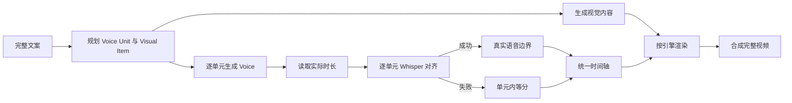

# 统一 Voice Unit 与音画同步设计

状态：首版权威设计

更新时间：2026-08-29

## 1. 结论

标准制作、自定义参考和动态信息图统一采用同一套时间策略：

```text
智能划分 Voice Unit
→ 每个单元独立生成 Voice
→ Whisper 优先解析图片对应原文的真实时间
→ 对齐失败时在该单元内按图片数等分实际 Voice 时长
→ 累计所有单元形成完整时间轴
```

Whisper 是首选时间源，但不再是任务必须成功的单点依赖。fallback 只影响失败单元，已成功的其他单元继续使用真实时间。

## 2. 最小模型

```text
完整文案
└── Voice Unit
    ├── 连续且不可改写的原文
    ├── 一份独立 Voice
    └── 一张或多张 Visual Item
```

- Voice Unit 是 TTS、恢复和时间 fallback 的边界；
- Visual Item 是一张图片、一个 PPT 页面或一个页面状态；
- 智能分割在 TTS 前决定每个 Visual Item 对应的连续原文范围；
- 2–3 句话和 1–2 张图片只能作为规划提示，不是硬限制。

## 3. 统一生产流程



三种模式只在 Visual 与 Render 阶段不同：

| 模式 | Visual Item | Renderer |
| --- | --- | --- |
| 标准制作 | 预设风格白板图片 | 白板绘制渲染器 |
| 自定义参考 | 参考风格/人物图片 | 白板绘制渲染器 |
| 动态信息图 | PPT 页面、插图或页面状态 | Remotion |

## 4. 文案规划契约

`av-plan.json` 示例：

```json
{
  "schema_version": 1,
  "units": [
    {
      "unit_id": "unit-001",
      "order": 1,
      "source_range": {"start": 0, "end": 41},
      "text": "以上内容基于公开数据和量化分析，仅供参考，不构成投资建议。市场有风险，投资需谨慎。",
      "visual_items": [
        {
          "visual_id": "unit-001-image-001",
          "source_range": {"start": 0, "end": 29},
          "text": "以上内容基于公开数据和量化分析，仅供参考，不构成投资建议。"
        },
        {
          "visual_id": "unit-001-image-002",
          "source_range": {"start": 29, "end": 41},
          "text": "市场有风险，投资需谨慎。"
        }
      ]
    }
  ]
}
```

强制规则：

1. 所有 Unit 按顺序 100% 覆盖完整原文；
2. Unit 与 Visual Item 只能引用连续原文，不能改写、遗漏或重复；
3. 一个 Unit 至少有一个 Visual Item；
4. Visual Item 的原文范围按顺序完整覆盖 Unit；
5. 文本模型不能直接输出毫秒时间。

## 5. Voice 与恢复

每个单元独立生成：

```text
读取 unit text
→ 计算 fingerprint
→ 调用 TTS 写 unit-NNN.partial.wav
→ 校验并规范化音频
→ 原子提交 unit-NNN.wav
→ ffprobe 读取实际 duration_ms
→ 更新 voice-manifest checkpoint
```

恢复规则：

- 某个 Unit 失败只重试该 Unit；
- fingerprint 未变化且 WAV 有效时直接复用；
- Whisper 失败不删除或重做 Voice；
- 所有 Unit 成功后按顺序拼接 `voice.wav`；
- master Voice 时长必须与各 Unit 时长之和在媒体容差内一致。

## 6. Whisper 成功路径

Whisper 对每个 Unit 的 Voice 生成 token 时间，然后将 Visual Item 的 `source_range/text` 按顺序绑定到真实语音范围。

对齐结果必须满足：

- 每个 Visual Item 都有合法起止时间；
- 时间严格按 Visual Item 顺序递增；
- 第一张图片从 Unit 起点开始；
- 最后一张图片保持到 Unit 结尾；
- 时间无重叠、无空洞；
- 所有切换点都位于 `[0, unit.duration_ms]`。

满足后记录：

```json
{
  "unit_id": "unit-001",
  "timing_source": "whisper",
  "alignment": {
    "status": "succeeded",
    "engine": "whisper"
  }
}
```

例如第二张图片对应“市场有风险，投资需谨慎”，其开始时间取该句第一个可靠语音 token 的起点。

## 7. Whisper 失败与等分 fallback

以下任一情况视为该 Unit 对齐失败：

- Whisper 进程或模型执行失败；
- 没有返回有效 token；
- Visual Item 原文无法按顺序完整匹配；
- 得到的时间越界、逆序、重叠或为空；
- 对齐结果未通过项目设定的最低质量门槛。

失败后不阻断任务，也不重做 TTS。该 Unit 的全部 Visual Item 统一改用等分时间，不能混用部分 Whisper 边界。

设 Unit 全局起点为 `S`，实际时长为 `D`，Visual Item 数量为 `N`，第 `i` 项从零开始编号：

```text
visual[i].start_ms = S + floor(i × D / N)
visual[i].end_ms   = S + floor((i + 1) × D / N)
```

该公式保证完整覆盖、无重叠、无空洞，并且各图片时长最多相差 1ms。

fallback 结果必须记录：

```json
{
  "unit_id": "unit-001",
  "timing_source": "equal_fallback",
  "alignment": {
    "status": "failed",
    "reason_code": "ALIGNMENT_TEXT_NOT_MATCHED"
  }
}
```

WebUI 显示“本段使用平均切图”，Skills 在结果中返回相同 warning。fallback 是可接受的完成状态，不是伪装成精确同步的成功状态。

## 8. 全局时间轴

Unit 的全局时间由实际 Voice 时长累计：

```text
unit[0].start_ms = 0
unit[i].start_ms = unit[i - 1].end_ms
unit[i].end_ms = unit[i].start_ms + unit[i].duration_ms
```

Whisper 返回的是 Unit 本地时间，写入最终 timeline 时加上 `unit.start_ms`。fallback 直接使用同一个全局起点公式。

`timeline.json` 示例：

```json
{
  "schema_version": 1,
  "units": [
    {
      "unit_id": "unit-001",
      "duration_ms": 10820,
      "timing_source": "whisper",
      "alignment": {"status": "succeeded", "engine": "whisper"},
      "visual_timings": [
        {
          "visual_id": "unit-001-image-001",
          "start_ms": 0,
          "end_ms": 7310
        },
        {
          "visual_id": "unit-001-image-002",
          "start_ms": 7310,
          "end_ms": 10820
        }
      ]
    }
  ],
  "warnings": []
}
```

## 9. 图片和页面组合

视觉资源的物理组合不能改变逻辑时间：

- 一个 Unit 一张图：覆盖整个 Unit；
- 一个 Unit 多张图：Whisper 成功时按真实原文边界，失败时等分；
- 多个 Visual Item 画在同一张 board：渲染器仍按 timeline 揭示对应区域；
- 动态信息图同一页逐项出现：每个页面状态作为 Visual Item，并使用同一时间策略。

转场只能发生在相邻 Item 已分配的窗口内，不能额外增加总时长或造成音画漂移。

## 10. 可跟踪性

每次单元处理继承 Run 的 `trace_id`，并建立 `voice-unit` span；TTS、媒体 probe、Whisper 和 timeline 提交使用其子 span。必须产生：

- `voice_unit.started/succeeded/failed`；
- `alignment.succeeded` 或 `alignment.fallback`；
- TTS/Whisper 的耗时、attempt、Provider/profile、音频时长和安全质量指标；
- fallback 的 `unit_id`、Visual 数量、Voice 实际时长、reason code 和最终 `timing_source`。

WebUI 与 Skills 读取同一事件和 Trace，因此同一个 fallback 不能在一端显示为成功对齐、另一端显示为估算。日志不保存完整原文、token 结果、参考音频或 Secret；详细规则见 [12-observability-and-diagnostics.md](12-observability-and-diagnostics.md)。

## 11. 产物与状态

每个项目至少保留：

```text
runs/<run-id>/artifacts/av-plan.json
runs/<run-id>/media/voices/unit-NNN.wav
runs/<run-id>/artifacts/voice-manifest.json
runs/<run-id>/artifacts/timeline.json
runs/<run-id>/artifacts/illustration-manifest.json
runs/<run-id>/artifacts/render-manifest.json
runs/<run-id>/artifacts/final-manifest.json
runs/<run-id>/observability/events.jsonl
runs/<run-id>/observability/logs.jsonl
```

对齐失败时允许没有有效 token 文件，但 `timeline.json` 必须保存错误原因和 `equal_fallback` 标记。

## 12. 验收标准

1. Unit 和 Visual Item 按顺序完整覆盖原文；
2. 每个 Unit 恰有一个有效 Voice，时长来自实际媒体探测；
3. 所有模式都先尝试 Whisper；
4. Whisper 成功时切换点来自真实语音边界；
5. Whisper 失败时只在失败 Unit 内等分，不影响其他 Unit；
6. 一个 Unit 内只能有一种 `timing_source`；
7. 所有 Item 时间连续、无重叠、无空洞；
8. 最后一个 Item 的终点等于 master Voice 实际时长；
9. fallback 在 WebUI、Skills 和产物中均清晰可见；
10. 单个 Voice、Whisper 或图片失败均可从对应 Unit 恢复。
11. fallback、retry 和失败均可通过同一 `trace_id` 从 WebUI 与 Skills 定位到对应 Unit。
