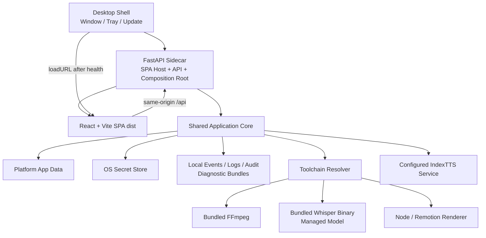

# macOS / Windows 桌面 APP 架构预留

状态：目标架构约束

更新时间：2026-08-29

## 1. 结论

现有项目可以演进为 macOS 和 Windows 桌面 APP，因为它已经具备“Web 前端 + 本地 FastAPI + 本地媒体/渲染进程”的基本形态。桌面化不需要重写业务内核，前端收敛为 React + Vite SPA，整体推荐采用：

```text
React + Vite SPA
→ 构建为静态资源并打包进 Backend Sidecar
→ FastAPI 同源托管 SPA 与 API
→ 薄桌面壳启动后端并加载本机 URL
→ 浏览器也可访问同一个服务
→ Backend 统一调度 TTS、Whisper、FFmpeg 和 Renderer
```

Vite 负责前端开发和静态生产构建，不负责桌面窗口、Python/FFmpeg/Whisper 打包或进程生命周期；这些职责仍由 Electron/Tauri 一类桌面壳承担。当前只能称为“Windows/macOS 可从源码启动”，还不能称为“可安装、可升级、可签名的桌面 APP”。Mountain 必须提前隔离运行目录、工具链、密钥和进程生命周期，避免未来桌面化时再次重构业务层。

## 2. 当前就绪度

| 能力 | 当前状态 | APP 化要求 |
| --- | --- | --- |
| React 与 FastAPI 分离 | 基本具备 | 将 Vinext/RSC 收敛为 Vite SPA，保留稳定 API 边界 |
| 本机 loopback 通信 | 已使用固定端口 | 改为动态端口、启动令牌与同源策略 |
| Windows/macOS 启动 | 有 Python 跨平台启动器 | 改为桌面壳监管 sidecar |
| 前端运行 | Vinext + Vite 的 RSC/Worker 构建 | 使用纯 Vite SPA 生产构建并嵌入或本地托管 |
| 项目数据 | 仓库下 `.webapp` | 迁移到系统 Application Data |
| Python/Node/FFmpeg | 依赖用户安装和 PATH | 通过 Toolchain Resolver 使用打包资源 |
| Whisper | 首次运行下载安装/编译 | 使用平台预构建程序、模型管理和校验 |
| API Key | 本地 JSON | 使用 Windows Credential Manager / macOS Keychain |
| TTS | 外部 IndexTTS URL | 保持 Provider 端口；是否捆绑作为独立发行决策 |
| 安装升级 | 无 | 签名、notarization、安装器和自动升级 |

## 3. 目标运行形态



桌面壳只负责：

- 单实例与窗口；
- 启停、健康检查和退出 Backend；
- 原生文件选择、导入和导出；
- 系统托盘、通知和升级；
- 将本次启动的 loopback 地址和令牌交给 WebUI。

桌面壳不得包含文案分割、Prompt、Provider、时间轴、恢复或渲染规则。所有业务规则继续位于共享 `csboard` 内核。

## 4. 三种入口关系

```text
浏览器 WebUI ──HTTP──┐
桌面 WebUI ───HTTP──┼→ Application Commands → Shared Core
CLI / Skills ─直接──┘
```

- 浏览器模式可以继续作为局域网 Web 应用；
- 桌面模式默认只绑定 loopback，不开放局域网；
- CLI/Skills 不依赖桌面壳，也不要求本地 HTTP 服务存在；
- 三种入口消费同一 Project、Stage、Artifact、Event、Log 和 Trace 契约；桌面启动的 Run 也能由 CLI/Skills 使用同一 `trace_id` 分析。

### 4.1 为什么选择纯 Vite SPA

当前核心页面全部在客户端使用 `fetch()` 调用 FastAPI，任务状态、上传、图库和设置都不需要服务端 React 渲染。保留 Vinext/Next/RSC 会额外要求一个前端 Node server 和 Cloudflare/Worker 运行时，增加桌面打包与进程管理复杂度。

目标运行方式：

```text
开发：Vite dev server --proxy /api → FastAPI
生产 Web：FastAPI → 同源托管 web-v2/dist 与 /api
桌面：Electron/Tauri → 启动 FastAPI sidecar → 健康检查 → loadURL(loopback)
```

这种同源方式避免 `file://`、CORS 和动态 API base 问题。Vite SPA 不直接访问本地文件系统；上传、下载和项目操作仍通过 API，桌面原生文件选择通过受限 Desktop Bridge 完成。

## 5. 必须新增的运行时端口

### 5.1 `RuntimePaths`

共享内核不得再从仓库 `ROOT` 推导可写目录。组合根必须注入：

```python
class RuntimePaths(Protocol):
    def data_dir(self) -> Path: ...
    def cache_dir(self) -> Path: ...
    def logs_dir(self) -> Path: ...
    def temp_dir(self) -> Path: ...
    def resources_dir(self) -> Path: ...
```

默认位置：

| 平台 | 数据目录 |
| --- | --- |
| Windows | `%LOCALAPPDATA%/CSBoard/` |
| macOS | `~/Library/Application Support/CSBoard/` |
| 源码开发 | 可显式使用仓库 `.webapp/` |

项目、缓存、日志、下载模型和只读应用资源必须分开。应用升级不得覆盖项目数据。

### 5.2 `ToolchainResolver`

业务代码不得直接调用 PATH 中偶然存在的 `node`、`ffmpeg`、`ffprobe` 或 Whisper。统一解析逻辑名称：

```text
python-runtime
node-runtime
ffmpeg
ffprobe
whisper
renderer-root
```

开发 profile 可以从虚拟环境和 PATH 解析；desktop profile 只能从已签名的应用资源或受管理缓存解析。

### 5.3 `ProcessSupervisor`

统一负责：

- 创建子进程组；
- 捕获标准输出和错误；
- 取消与超时；
- App 退出时优雅终止；
- 崩溃后清理孤儿进程；
- Windows 和 macOS 的平台差异。

每个子进程继承调用 span，上报可执行文件逻辑名、版本、PID、耗时、退出码和有界 stderr 摘要。绝对用户路径、环境变量和命令行 Secret 必须在写日志前脱敏。

Stage 不直接使用 `subprocess`。

### 5.4 `SecretStore`

API Key、访问令牌和未来许可证不进入 Project、Artifact、日志或普通 JSON 配置。

- Windows adapter：Credential Manager；
- macOS adapter：Keychain；
- 开发 adapter：环境变量或受限本地文件；
- CLI adapter：允许显式选择环境变量来源。

### 5.5 `FrontendHost` / `DesktopBridge`

前端只使用 HTTP API 和少量原生桥接能力。桥接接口限制为：

- 选择文件/目录；
- 打开输出目录；
- 系统通知；
- 应用版本、更新和退出确认。

不得通过桥接直接读写 Project 内部文件。

## 6. 本机 API 安全

当前固定 `127.0.0.1:18765` 和固定 CORS 白名单适合开发，不适合作为桌面协议。desktop profile 应当：

1. 在 loopback 上选择可用随机端口；
2. 每次启动生成高熵 session token；
3. 桌面壳通过受控方式把端口和 token 交给 WebUI；
4. 所有变更型 API 验证 token；
5. 优先由同一个本地 origin 提供生产 WebUI，减少 CORS；
6. 禁止 desktop profile 绑定 `0.0.0.0`；
7. LAN 共享必须使用显式 web profile 单独开启。

## 7. 依赖与分发边界

首个桌面版本建议打包：

- 生产 WebUI，并作为 FastAPI 静态资源打包；
- Python Backend runtime、项目 Python 依赖和 SPA host；
- FFmpeg / ffprobe；
- Node/Remotion 所需 runtime 和 renderer 资源；
- 对应平台及架构的 Whisper 可执行文件。

Whisper 模型体积较大，可以首次使用时下载到受管理 cache，但必须包含版本、校验和、断点续传与损坏恢复。

IndexTTS 暂时保持外部 Provider：桌面 APP 负责配置、检测和提示，不把 GPU 驱动、模型权重和平台推理环境直接耦合进主安装包。未来若要提供一键本地 TTS，应作为独立可选 worker 包，不改变 `TTSPort`。

## 8. 桌面壳技术选择

Vite 不替代 Electron 或 Tauri。当前架构不把业务绑定到某个桌面壳；Electron/Tauri 都只实现 Desktop Shell 与 Bridge，启动包含 Vite `dist` 的 FastAPI sidecar，并加载其本机 URL。

现阶段 Electron 是优先验证候选，因为项目已经依赖 Node、React、Remotion 和 Chromium 渲染生态；Tauri 的安装壳更小，但 Python、FFmpeg、Whisper 和 Node/Remotion sidecar 仍然存在，整体包体优势有限。

最终选择前必须完成一个最小 spike，比较：

- Windows x64；
- macOS Apple Silicon；
- 后端和 renderer sidecar 启停；
- Remotion/Chromium 渲染；
- Whisper 二进制与模型下载；
- 签名/notarization；
- 安装包体积、冷启动和升级。

无论 spike 选择哪一个，`csboard` 共享内核、FastAPI API 和 Artifact 契约都不改变。

## 9. 生命周期

```text
启动桌面壳
→ 确认单实例
→ 解析平台目录与工具链
→ 启动 Backend 随机 loopback 端口
→ 健康检查与版本握手
→ 加载 WebUI
→ 恢复未完成 Project 状态
```

桌面壳自身使用独立 `component=desktop-shell` 的结构化启动日志，并记录 sidecar 启动 span、动态端口分配、健康检查、版本握手和退出原因。壳日志与业务 Run 日志分开；只有业务命令进入 Run Trace。崩溃报告不得附带未脱敏原始日志。

关闭窗口时，若存在运行任务，应明确选择继续后台运行或安全取消。操作系统强制退出后，下一次启动通过 Project/Stage checkpoint 恢复，不能依赖内存队列还存在。

## 10. 现在必须遵守的约束

即使近期不制作桌面安装包，Mountain PR 也必须遵守：

1. 共享内核不读取仓库绝对根目录；
2. 可写数据与只读应用资源分离；
3. 外部工具只能通过 `ToolchainResolver`；
4. 子进程只能通过 `ProcessSupervisor`；
5. 密钥只能通过 `SecretStore`；
6. FastAPI 是入口 adapter，不是业务内核；
7. WebUI 不直接访问本地文件路径；
8. pipeline 不依赖固定端口或浏览器 origin；
9. 所有路径、进程和字体测试覆盖 Windows 与 macOS；
10. Project 数据必须能跨升级保留并支持导出；
11. Web、CLI、Skill 和 desktop-shell 使用统一关联 ID、Redactor 和诊断包格式。

## 11. 分阶段落地

### Mountain 主线内完成

- M02：`RuntimePaths`、`ToolchainResolver`、`ProcessSupervisor`、`SecretStore` 与 Project 数据目录解耦；
- M07：将 Vinext/RSC 前端迁移为 React + Vite SPA，并使用运行时 API base；
- M08：Windows/macOS 平台测试、生产前端构建、平台日志目录、轮转、crash 摘要和脱敏诊断包验证。

### 后续桌面化里程碑

- D01：Electron/Tauri sidecar spike；
- D02：桌面壳、单实例、文件桥接和本地认证；
- D03：Windows 签名安装包；
- D04：macOS Apple Silicon 签名与 notarization；
- D05：更新、崩溃恢复和发布通道。

## 12. 验收标准

1. 同一共享内核可由浏览器 Web、桌面壳和 CLI 驱动；
2. 源码目录只读时 APP 仍能创建和恢复 Project；
3. 不安装系统 Python、Node 或 FFmpeg 也能启动打包版本；
4. desktop profile 只监听 loopback，并校验启动 token；
5. API Key 不以明文进入普通配置或日志；
6. Whisper、FFmpeg 和 Renderer 均从受管理工具链解析；
7. App 升级不会覆盖项目、模型缓存或用户设置；
8. Windows x64 和 macOS Apple Silicon 完成真实视频 smoke test；
9. 关闭窗口、异常退出和重启后任务状态可解释、可恢复；
10. 桌面入口与 WebUI/Skills 产生相同结构的 Artifact；
11. 桌面启动、sidecar、工具子进程与业务 Run 能通过关联 ID 分层定位，诊断包不含 Secret 或完整正文。
