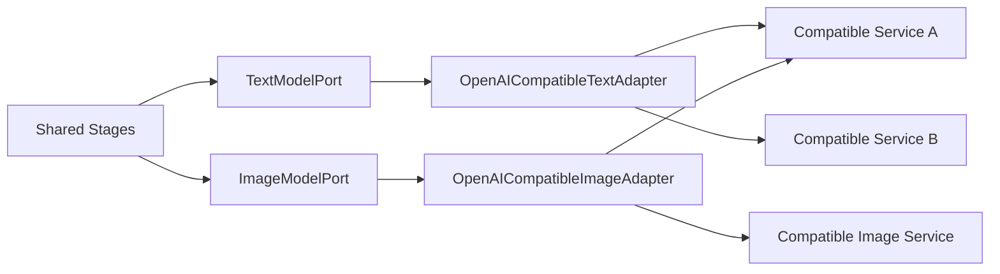

# OpenAI API-compatible 模型接入架构

状态：目标架构约束

更新时间：2026-08-29

## 1. 结论

Mountain 不把文本、图片、语音、对齐、渲染或媒体能力固化到 OpenLux、OpenAI 或其他品牌。共享内核只依赖能力端口；基础设施层可提供 OpenAI API-compatible、Local Service 或 Codex Skill adapter。

“ChatGPT兼容”在代码和文档中统一称为“OpenAI API-compatible”，首版基线协议为：

```text
文本：POST /v1/chat/completions
可选文本：POST /v1/responses
图片：POST /v1/images/generations
可选图片：兼容的 edits / 输入参考图能力
模型发现：GET /v1/models（可选）
认证：Authorization: Bearer <secret>
```

不是所有兼容服务都实现全部端点，因此系统必须按 capability 使用能力，不能从 Provider 名称猜测。

## 1.1 动态 Provider Registry 与能力绑定

产品不以固定六个 Provider Profile 作为长期模型。后端应提供可扩展的 Provider Registry：用户可新增、编辑、启停或删除供应商；前端只消费 Registry 与可用性 View，不能在 localStorage 中创建伪 Provider。

一个 Provider 可以声明多个能力，而“模型类别”是能力过滤器，不是强制的一对一 Provider 类型。首版能力键建议为：

```text
text.generate
image.generate
speech.synthesize
audio.align
video.render
media.compose
```

当前默认绑定为：本地 Codex Skills 提供 `image.generate`，本地 IndexTTS 提供 `speech.synthesize`，Whisper 提供 `audio.align`，白板/FFmpeg 提供本地 `video.render`/`media.compose`。它们都是可见的运行时能力；尚未接入外部图片、音频或视频 API 时，不能在 UI 假装已有可选远程模型。

未来接入外部服务时，新增 Registry 条目和 capability binding，不改 Stage 业务规则。Task/Run 只保存已选择 binding 的非敏感快照与版本，不保存 API Key。

## 2. 端口与适配器



领域层不得出现 Provider URL、SDK 类型、HTTP payload 或品牌名称。

### 2.1 `TextModelPort`

```python
class TextModelPort(Protocol):
    def generate(self, request: TextGenerationRequest) -> TextGenerationResult: ...
    def capabilities(self) -> TextModelCapabilities: ...
```

规范化请求包含：

- system/user messages；
- model logical id；
- JSON Schema 或结构化输出要求；
- temperature、max output tokens 等通用参数；
- timeout、retry policy、`trace_id/span_id` 和内部 request id。

规范化结果包含：

- text；
- validated structured value；
- finish reason；
- token usage；
- model identity；
- request id 和非敏感 provider metadata。

Stage 不直接读取 `choices[0].message.content` 或 Responses API 的 output block。

### 2.2 `ImageModelPort`

```python
class ImageModelPort(Protocol):
    def generate(self, request: ImageGenerationRequest) -> ImageGenerationResult: ...
    def capabilities(self) -> ImageModelCapabilities: ...
```

文本模型和图片模型允许使用不同 profile、base URL、API Key 与模型。图片参考输入、编辑、尺寸和返回格式属于 capability，不假设所有 OpenAI-compatible 服务都支持。

## 3. Provider Profile

配置使用可命名 profile，而不是全局写死一组 OpenLux 字段：

```json
{
  "profiles": [
    {
      "id": "primary-text",
      "adapter": "openai-compatible",
      "base_url": "https://model.example.com/v1",
      "secret_ref": "model-profile/primary-text",
      "text": {
        "protocol": "chat_completions",
        "model": "example-text-model",
        "capabilities": {
          "json_schema": true,
          "model_discovery": true
        }
      }
    },
    {
      "id": "primary-image",
      "adapter": "openai-compatible",
      "base_url": "https://image.example.com/v1",
      "secret_ref": "model-profile/primary-image",
      "image": {
        "protocol": "images_generations",
        "model": "example-image-model",
        "capabilities": {
          "reference_images": false,
          "response_format": ["b64_json", "url"]
        }
      }
    }
  ],
  "defaults": {
    "text_profile_id": "primary-text",
    "image_profile_id": "primary-image"
  }
}
```

`secret_ref` 指向 Secret Store，Artifact、Task 和普通配置 view 不保存明文 API Key。

## 4. 协议兼容

### 4.1 Chat Completions 基线

首版必须支持 `/chat/completions`，因为它是兼容服务覆盖面最广的文本接口。内部 messages 直接映射到该协议。

### 4.2 Responses 可选

若 profile 声明 `protocol=responses`，adapter 将相同内部请求翻译为 `/responses`。是否支持输入图片、工具、JSON Schema 等仍由 capability 决定，不能因为端点名称是 Responses 就自动假定。

### 4.3 结构化输出

优先使用服务声明支持的 JSON Schema。若只支持普通 JSON：

```text
模型返回文本
→ 提取 JSON
→ 本地 Schema 校验
→ 不合法则按统一策略重试
→ 仍不合法则返回 MODEL_OUTPUT_INVALID
```

该 fallback 是协议能力降级，不是 Provider 品牌分支。

### 4.4 图片兼容

`/images/generations` 作为基础能力。自定义人物参考可能需要图片编辑或多模态输入；若当前 profile 不支持，capability API 必须返回 unsupported，WebUI/Skills 给出明确提示或要求选择另一个图片 profile。

## 5. URL 与认证规则

- `base_url` 在 profile 中配置，不在 Stage、Prompt 或 Skill 中出现；
- adapter 统一处理末尾 `/` 和 `/v1`，禁止调用方手工拼 URL；
- 默认 Bearer token，通过 `secret_ref` 读取；
- 未来其他认证方式通过 auth adapter 扩展，不加入领域模型；
- 日志只能记录 profile id、协议、模型和脱敏 origin；
- API Key 不进入异常、事件、Artifact、CLI JSON 或前端配置响应。

## 6. Capability 契约

健康检查返回实际可用能力：

```json
{
  "profile_id": "primary-text",
  "adapter": "openai-compatible",
  "protocol": "chat_completions",
  "model": "example-text-model",
  "capabilities": {
    "text": true,
    "json_schema": true,
    "image_generation": false,
    "reference_images": false,
    "model_discovery": true
  }
}
```

Pipeline 根据 capability 判断是否可运行；WebUI 不根据 model name 或 Provider 名称隐藏功能。

## 7. 错误与重试

adapter 将兼容服务的响应统一为稳定错误码：

```text
MODEL_AUTH_FAILED
MODEL_NOT_FOUND
MODEL_RATE_LIMITED
MODEL_TIMEOUT
MODEL_SERVICE_UNAVAILABLE
MODEL_OUTPUT_INVALID
MODEL_CAPABILITY_UNSUPPORTED
MODEL_RESPONSE_INVALID
```

重试依据 HTTP 状态、标准错误结构和 `Retry-After`，不解析品牌化错误文案。未知错误保留脱敏状态码、Provider request id 和有限响应摘要。

### 7.1 Provider 可观测性

每次请求建立 Provider 子 span，并记录 profile id、adapter/protocol、model、capability、attempt、HTTP 状态、Provider request id、延迟、token/图片数量和规范化错误码。`base_url` 只记录脱敏 origin。

默认禁止记录 Authorization、Secret、完整 messages/prompt、参考图片、完整响应或生成图片内容。若排障必须查看 payload，只能通过显式短时 debug policy 生成受权限保护的独立诊断 Artifact，不能写入普通日志或由 Skill 回显。

## 8. Artifact 与指纹

模型生成 Artifact 记录：

- adapter contract version；
- profile id；
- protocol；
- model id；
- capability snapshot；
- prompt version；
-通用生成参数；
- request/response schema version。

输入 fingerprint 包含这些非敏感字段，但不包含 API Key。切换 profile、model、protocol 或能力配置会使相关下游产物失效。

## 9. WebUI 与 Skills

WebUI 的“API设置”调整为“模型服务”：

- Provider 名称、来源（本地 Skill / 本地服务 / 远程 API）与能力类别；
- 每个 capability 的模型、协议与非敏感 endpoint 配置；
- 密钥状态、连接测试和真实 capability；
- 默认 binding 与 Task 可选 binding。

新增/删除 Provider 是后端 Registry API 的职责，不能做成仅前端有效的 CRUD。密钥输入只向 SecretStore 提交，提交后清空；不显示完整 Key，不写入 localStorage/sessionStorage、Task、Artifact、事件、日志、诊断包或普通 API 响应。

“工具链”不属于模型服务 CRUD：Renderer、FFmpeg 与本地 Whisper 等应显示版本、探测状态、error_code 和 suggestion；没有真实配置 API 时只读展示。“存储”同理，在不存在保留策略/配额 API 前不得提供假的可保存表单。Task 级日志、Trace 和诊断包归任务工作台，不伪装为全局设置。

Skills 只接受 `text_profile_id` 和 `image_profile_id`，不能传入或显示 API Key，也不能在 Skill 内写死服务 URL。

## 10. 现有配置迁移

当前 `base_url/api_key/text_model/image_model` 可无损迁移为一个兼容 profile：

```text
legacy base_url     → profile.base_url
legacy api_key      → SecretStore + profile.secret_ref
legacy text_model   → profile.text.model
legacy image_model  → profile.image.model
legacy Responses    → profile.text.protocol=responses
```

迁移只改变配置表示，不改变已有任务产物。旧任务继续保存其当时的模型和 pipeline metadata。

## 11. 验收标准

1. `csboard` Domain、Stage、Skill 和 Web route 中不存在品牌化模型调用；
2. 同一 fake `TextModelPort` 可运行全部文案和分镜测试；
3. `/chat/completions` 兼容服务可以完成文本规划；
4. `/responses` profile 可以完成相同内部请求；
5. 文本与图片允许使用不同 base URL 和 secret；
6. capability 缺失时返回稳定错误而不是调用到一半失败；
7. API Key 不出现在日志、Artifact、CLI、Task View 或浏览器响应；
8. 切换 profile/model/protocol 会正确失效下游 Artifact；
9. WebUI 与 Skills 对相同 profile 显示一致 capability；
10. 现有 OpenLux 配置能迁移为普通 OpenAI-compatible profile，而不是保留专用业务分支。
11. WebUI 与 Skills 可通过同一 Trace 查看 Provider 延迟、重试和 request id，且 Secret canary 不出现在日志或诊断包。
